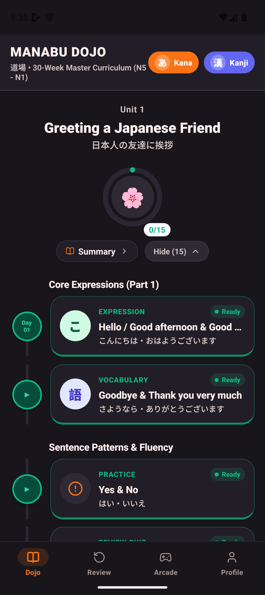
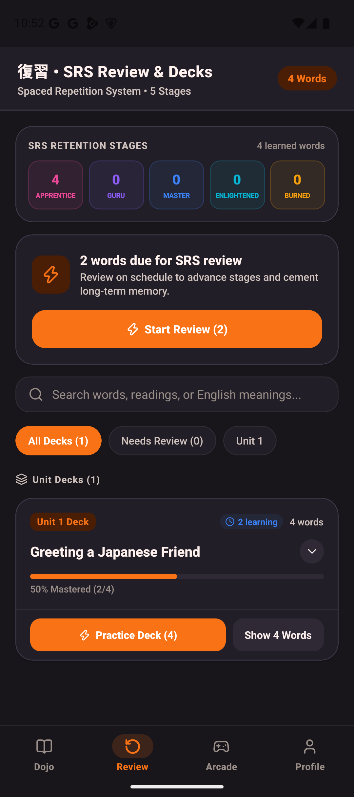
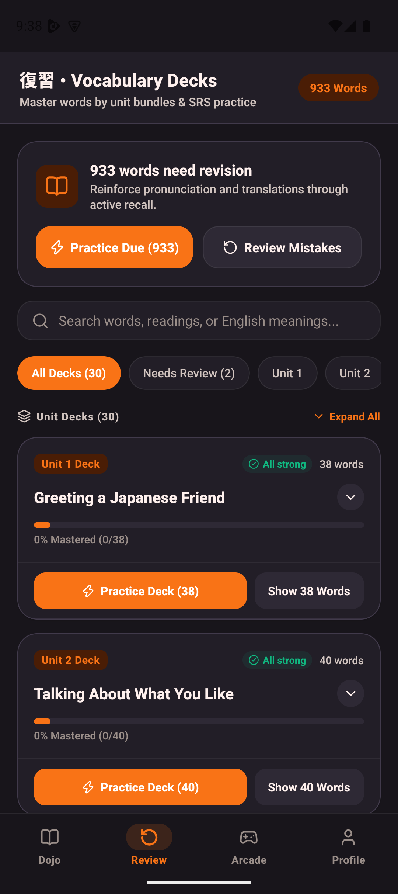
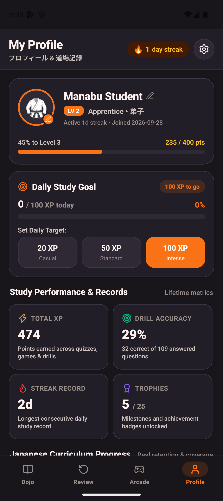

<p align="center">
  
</p>

<h1 align="center">学ぶ Manabu</h1>

<p align="center">
  <strong>Master Japanese — from first Kana to JLPT N1</strong>
  <br />
  Offline-first mobile application & 1:1 Next.js web platform with stroke tracing, spaced repetition, live cross-platform PvP, and arcade games.
</p>

<p align="center">
  <a href="https://manabu-admin.vercel.app" target="_blank">
    
  </a>
  
  
  
  
  
  
</p>

---

## 🌐 Platforms: Mobile & Web (1:1 Parity)

Manabu is available as both an offline-first **React Native Android/iOS** app and a fully responsive **Next.js Web Application** deployed at **[manabu-admin.vercel.app](https://manabu-admin.vercel.app)**. Both platforms share synchronized curricula, stroke data, and cross-platform real-time matchmaking.

<div align="center">

| Mobile Dojo | Mobile Review | Mobile Arcade | Web Platform |
|:-----------:|:-------------:|:-------------:|:------------:|
|  |  |  |  |

</div>

---

## ✨ Features

### 📖 Learn (Dojo)
- **30-week master curriculum** — structured learning path from absolute beginner (50 音) to advanced N1
- **Kana charts** — complete Hiragana & Katakana reference tables with interactive stroke tracing
- **2,495 Kanji** — complete JLPT N5 through N1 database with on'yomi, kun'yomi, English meanings, radicals, and stroke orders
- **Core Vocabulary drills** — thousands of curated vocabulary words with authentic Japanese TTS pronunciation
- **Verb conjugator** — Godan, Ichidan, and irregular inflection tables
- **7-day unit pacing & cumulative checkpoints** — retention checkpoints ensure prior unit mastery before unlocking future days

### ✍️ Stroke Master (Mobile & Web)
- Authentic **KanjiVG** vector paths for Kana and Kanji
- Real-time Bézier path evaluation: stroke order, direction, curvature, and accuracy scoring
- Visual step-by-step guided animation and demo playback mode
- Web stroke canvas (`/stroke`) with guide mode, test mode, and interactive audio feedback

### 🔁 Spaced Repetition System (SRS)
- **5-stage WaniKani retention system**:
  - **Apprentice (I–IV)**: 4 hours → 8 hours → 24 hours → 48 hours
  - **Guru (I–II)**: 7 days → 14 days
  - **Master**: 30 days
  - **Enlightened**: 120 days
  - **Burned**: Mastered / permanent retention
- Dynamic review queue scoped to active curriculum units
- Vocabulary and Kanji decks organized by JLPT level and curriculum week

### 🎮 Arcade Hub (10 Games & Cross-Platform PvP)
Play solo against AI bots or challenge friends and rivals in real-time cross-platform matches via **Valkey / Redis** matchmaking:

| Game | Mode | Description | Engine |
|------|------|-------------|--------|
| ⚔️ **Kanji Duel** | Solo / Live PvP | Real-time combat testing on'yomi, kun'yomi, radicals, and stroke count | `kanjiDuelEngine.ts` |
| 🎴 **Karuta Battle** | Solo / Live PvP | Japanese card-slap duel with audio Yomite reader and Otetsuki penalty rules | `karutaEngine.ts` |
| 🔤 **Shiritori Arena** | Solo / Live PvP | Japanese word-chain duel with Hiragana normalization and 'ん' loss condition | `shiritoriEngine.ts` |
| 🟩 **Japanese Wordle** | Solo / Daily | 5-character Japanese word puzzle with color-coded feedback | `wordleEngine.ts` |
| 🎣 **Kana Catch** | Solo Arcade | Falling character basket catcher with reflex physics | `catchEngine.ts` |
| ⚡ **Bushido Survival** | Solo Reflex | Rapid-fire sudden-death recognition challenge | `survivalEngine.ts` |
| 🐍 **Kana Snake** | Solo Arcade | Classic snake eating target kana characters with dynamic objectives | `snakeEngine.ts` |
| 🌧️ **Kana Rain** | Solo Arcade | Matrix-style falling character defense barrage | `rainEngine.ts` |
| 🎴 **Speed Match** | Solo Memory | Card-flip pair matching (kana-romaji, kanji-meaning) | `memoryEngine.ts` |
| ⏱️ **Flash Rush** | Solo Sprint | 60-second high-speed recognition sprint | `FlashRushView.tsx` |

- **Daily Challenge Gauntlet**: 3-stage rotating daily challenge with streak tracking and bonus XP.

### 👥 Clan & Friends (Social & Duels)
- **Unique Friend Codes** (e.g. `R4B6-53B4`) for frictionless friend discovery
- **Live Weekly Clan Leaderboard** ranking XP and study streaks
- **Direct Live Duels & Score Challenges**: Challenge friends to Shiritori, Karuta, or Kanji Duels directly from the friends list
- **Cross-Platform**: Mobile and Web players share the same friends list, leaderboards, and duel rooms

### 👤 Profile & Progression
- Customizable avatar emoji & display name
- **Martial arts belt ranking system** (White Belt → Grandmaster)
- **Dual currency system**: Total Study XP (effort) vs Dojo Belt Points (rank progression)
- Daily XP study goals (Casual 20 XP / Standard 50 XP / Intense 100 XP)
- Compact 3-column achievement showcase with tap-to-inspect detail sheets
- 2×2 priority weakness grid with direct 1-tap reinforcement into SRS review
- Curriculum mastery progress for Kana, Kanji, and Core Vocabulary

---

## 🏗️ Architecture & Tech Stack

```
manabu/
├── src/                         # React Native / Expo Mobile App
│   ├── app/                     # Expo Router file-based screens & tabs
│   ├── core/                    # Theme, TTS audio, MMKV storage, sync services
│   └── features/                # Feature-first modular packages
│       ├── dojo/                # Curriculum & daily lessons
│       ├── kana/                # Charts & stroke tracing
│       ├── kanji/               # N5–N1 repository & dictionary
│       ├── vocabulary/          # JLPT vocabulary lists
│       ├── review/              # WaniKani-style SRS engine
│       ├── arcade/              # 10 games, AI bots, duel lobbies
│       ├── community/           # Clan, friends, friend requests
│       ├── sync/                # CloudSync service & conflict resolution
│       └── profile/             # Stats, achievements, belt ranking
│
└── admin/                       # Next.js 16 Web Application (1:1 Web Client & API)
    ├── app/                     # App Router pages (/arcade, /friends, /stroke, etc.)
    │   └── api/v1/              # REST & Duel matchmaking endpoints
    ├── components/arcade/       # 9 React web game components & lobby modal
    ├── lib/                     # API client, Valkey client, PostgreSQL pool, auth
    └── data/                    # KanjiVG vectors, JLPT datasets, curriculum
```

### Mobile Tech Stack
- **Framework**: React Native 0.86.3 + Expo SDK 57 (New Architecture, React 19.2.3)
- **Routing**: Expo Router v57
- **State & Local Storage**: Zustand v5 + MMKV (high-performance synchronous storage)
- **Vector Graphics**: react-native-svg 15.15 (authentic KanjiVG Bézier stroke rendering)
- **Audio & Haptics**: expo-speech (Japanese TTS) & expo-haptics
- **Authentication**: Firebase Authentication + Native Google Sign-In

### Web & Backend Stack
- **Web Framework**: Next.js 16 (Turbopack, App Router, SSR + Client Components)
- **Styling**: Tailwind CSS + Lucide Icons
- **Database**: PostgreSQL (Neon / Drizzle) for user profiles, friend connections, and cloud backups
- **Real-Time Cache & Matchmaking**: Valkey / Redis for live PvP duel matchmaking and challenge queues
- **Audio**: Web Speech API (`speechSynthesis` with `ja-JP` voice engine)
- **Hosting**: Vercel Production Deployment ([manabu-admin.vercel.app](https://manabu-admin.vercel.app))

---

## 🚀 Getting Started

### Prerequisites
- Node.js 18+ & Bun (for web app)
- Android Studio or Xcode (for mobile development builds)
- Android/iOS emulator or physical device

### Mobile Setup (React Native)

```bash
# Clone the repository
git clone https://github.com/addynoven/manabu.git
cd manabu

# Install root dependencies
npm install

# Start the Expo development server
npx expo start --dev-client

# Run on Android emulator / device
npx expo run:android

# Run on iOS simulator / device
npx expo run:ios
```

> ⚠️ **Note:** Manabu utilizes native modules (MMKV, SVG, Haptics) and requires a development build (`npx expo run:android` / `npx expo run:ios`). It does not run in Expo Go.

### Web Setup (Next.js)

```bash
cd admin

# Install dependencies with Bun
bun install

# Start local Next.js development server
bun dev

# Build production bundle
bun run build
```

### Useful CLI Commands

```bash
npx expo install <package>   # Installs SDK-57 compatible package versions
npx tsc --noEmit             # TypeScript type check (Mobile)
npm test                     # Run mobile Vitest unit & integration test suites
npx expo lint                # Lint mobile codebase
cd admin && bun run build    # Build & validate Next.js web application
```

---

## 🧪 Testing

```bash
npm test
```

- **33 test suites**, **200+ tests** across mobile and web logic
- Integration-first testing verifying engine behavior, SRS stage transitions, and conflict resolution
- Co-located `__tests__/` within each feature module

---

## 🎨 Themes

Manabu ships with 4 built-in theme palettes:
- 🌃 **Tokyo Night** (Default dark)
- 🌅 **Kyoto Sunset** (Warm dark)
- 🖤 **OLED Dark** (Pure pitch black)
- ☀️ **Light Mode** (Clean daytime palette)

---

## 🗺️ Roadmap & Status

- [x] Complete 30-week Dojo curriculum (Kana → N1)
- [x] Authentic KanjiVG Bézier stroke tracing (Mobile & Web)
- [x] 5-stage WaniKani SRS review system
- [x] 10 Arcade games with dedicated game engines
- [x] Real-time cross-platform PvP Duels & matchmaking via Valkey
- [x] Clan & Friends with live weekly board and unique friend codes
- [x] Cloud sync & backup with PostgreSQL and Firestore fallback
- [x] 1:1 Web client & admin platform deployed to Vercel
- [ ] iOS build & TestFlight release
- [ ] Listening comprehension exercises
- [ ] Grammar guide & sentence construction drills

---

## 📄 License

This project is licensed under the MIT License — see the [LICENSE](LICENSE) file for details.

---

## 🙏 Acknowledgments

- [KanjiVG](https://kanjivg.tagaini.net/) — Authentic stroke order vector dataset
- [EDICT / JMDict](http://www.edrdg.org/) — Japanese-English dictionary data
- [Expo](https://expo.dev/) — React Native development platform
- [WaniKani](https://www.wanikani.com/) — Spaced repetition pacing inspiration

---

<p align="center">
  Built with ❤️ for Japanese learners everywhere
  <br />
  <strong>学ぶ — to learn</strong>
</p>
