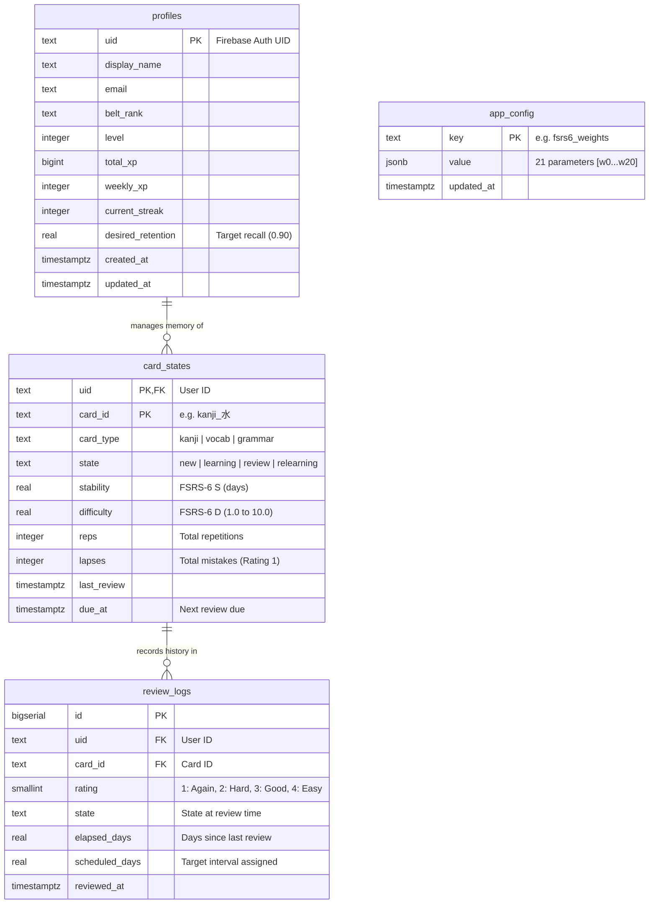

# Manabu Production-Ready FSRS-6 Database Schema



---

## 💻 SQL Production DDL

```sql
CREATE SCHEMA IF NOT EXISTS manabu;

-- 1. Learner Profiles & Settings
CREATE TABLE manabu.profiles (
    uid                TEXT PRIMARY KEY,                     -- User ID from Firebase Auth
    display_name       TEXT NOT NULL,
    email              TEXT UNIQUE,
    belt_rank          TEXT NOT NULL DEFAULT 'white',
    level              INT NOT NULL DEFAULT 1,
    total_xp           BIGINT NOT NULL DEFAULT 0,
    weekly_xp          INT NOT NULL DEFAULT 0,
    current_streak     INT NOT NULL DEFAULT 0,
    desired_retention  REAL NOT NULL DEFAULT 0.90 CHECK (desired_retention >= 0.70 AND desired_retention <= 0.97),
    created_at         TIMESTAMPTZ NOT NULL DEFAULT NOW(),
    updated_at         TIMESTAMPTZ NOT NULL DEFAULT NOW()
);

-- 2. Current Card State (FSRS-6 Memory Engine)
CREATE TABLE manabu.card_states (
    uid          TEXT NOT NULL REFERENCES manabu.profiles(uid) ON DELETE CASCADE,
    card_id      TEXT NOT NULL,                               -- e.g. "kanji_水" or "vocab_1483185"
    card_type    TEXT NOT NULL CHECK (card_type IN ('kanji', 'vocab', 'grammar')),
    state        TEXT NOT NULL CHECK (state IN ('new', 'learning', 'review', 'relearning')),
    stability    REAL NOT NULL DEFAULT 0.0,                   -- FSRS-6 Stability S (days)
    difficulty   REAL NOT NULL DEFAULT 5.0 CHECK (difficulty >= 1.0 AND difficulty <= 10.0), -- D
    reps         INT NOT NULL DEFAULT 0,                      -- Total repetition count
    lapses       INT NOT NULL DEFAULT 0,                      -- Total memory lapses (Rating 1)
    last_review  TIMESTAMPTZ,
    due_at       TIMESTAMPTZ NOT NULL DEFAULT NOW(),
    PRIMARY KEY (uid, card_id)
);

-- Index for fetching active review queue (WHERE uid = $1 AND due_at <= NOW())
CREATE INDEX idx_card_states_due ON manabu.card_states (uid, due_at ASC);

-- 3. FSRS-6 Review History Logs
CREATE TABLE manabu.review_logs (
    id             BIGSERIAL PRIMARY KEY,
    uid            TEXT NOT NULL,
    card_id        TEXT NOT NULL,
    rating         SMALLINT NOT NULL CHECK (rating BETWEEN 1 AND 4), -- 1:Again, 2:Hard, 3:Good, 4:Easy
    state          TEXT NOT NULL CHECK (state IN ('new', 'learning', 'review', 'relearning')),
    elapsed_days   REAL NOT NULL DEFAULT 0.0,                 -- Interval since previous review
    scheduled_days REAL NOT NULL DEFAULT 0.0,                 -- Target interval assigned
    reviewed_at    TIMESTAMPTZ NOT NULL DEFAULT NOW(),
    CONSTRAINT fk_user_card FOREIGN KEY (uid, card_id) 
        REFERENCES manabu.card_states(uid, card_id) ON DELETE CASCADE
);

-- Index for review history queries and weight optimization
CREATE INDEX idx_review_logs_card_history ON manabu.review_logs (uid, card_id, reviewed_at ASC);

-- 4. Global App Configuration & FSRS-6 Weights
CREATE TABLE manabu.app_config (
    key        TEXT PRIMARY KEY,                              -- e.g. "fsrs6_weights"
    value      JSONB NOT NULL,                                -- Array of 21 parameters [w0 ... w20]
    updated_at TIMESTAMPTZ NOT NULL DEFAULT NOW()
);
```

---

## 📐 Schema Architectural Highlights

1. **Composite Foreign Key (`fk_user_card`)**:
   - `review_logs` links directly to `card_states(uid, card_id)` with `ON DELETE CASCADE` to prevent orphaned review logs.
2. **Indexed Review Queue (`idx_card_states_due`)**:
   - Fast $O(\log N)$ query performance for daily review queues (`WHERE uid = $1 AND due_at <= NOW()`).
3. **Data Integrity Check Constraints**:
   - `difficulty` enforced between `1.0` and `10.0`.
   - `rating` enforced between `1` (Again) and `4` (Easy).
   - `desired_retention` enforced between `0.70` and `0.97` (default `0.90`).
4. **Optimized Storage Types**:
   - Uses `REAL` (`FLOAT4`) for FSRS $S, D$, and interval days, cutting RAM/disk footprint in half while maintaining full single-precision float accuracy.
5. **Decoupled Content**:
   - `card_id` joins directly with client-side content bundles (`curriculum.json`, `kanji_n5.json`, `vocab_n5.json`), so content updates never tangle or corrupt user SRS progress.
